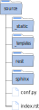

Installer son environnement
===========================

Environnement Python
--------------------

Quel que soit votre machine et votre système d'exploitation, l'autodocumentation avec sphinx ne nécessite que le langage Python. Assurez-vous d'avoir ce langage installé. Dans le cas contraire, rendez vous sur la page de téléchargement de Python et installez-le.

.. _`Téléchargement de Python`: https://www.python.org/downloads/

.. figure:: https://www.python.org/static/img/python-logo.png
   :scale: 50%
   :align: center
   :class: background-blue border-radius-4 margin-top-8 margin-bottom-4

   `Téléchargement de Python`_

Sphinx est un module Python. Comme tout module Python, on utilise la commande ``pip`` dans une console pour l'installer.

.. code-block:: bash
   
   pip install sphinx

D'autres modules dépendant du module ``sphinx`` permettent d'ajouter des fonctionnalité à la construction de la documentation. On peut citer ``nbsphinx``, ``sphinx-design`` et ``sphinx-book-theme``.

- Le module ``nbsphinx`` permet d'ajouter des notebook dans notre documentation.
- Le module ``sphinx-design`` permet d'ajouter quelques effets visuels
- Le module ``sphinx-book-theme`` est un theme pour nos pages web.

.. important::

   Pour ajouter des notebook, il sera nécessaire d'installer les modules ``pandoc`` et ``jupyter``.

Tous ces modules peuvent être installés en les plaçant dans un fichier ``requirements.txt`` et en saisissant dans une console la commande ``pip install -r requirements.txt``.

.. literalinclude:: ../../../requirements.txt

Première documentation
----------------------

Après l'installation des modules, on va créer notre première documentation avec la commande ``sphinx-quickstart`` dans une console. Mais avant, on crée un
répertoire **documentation** qui contiendra toute la structure et les contenus présentés ci-après.

.. tip::
   Ouvrir votre explorateur windows, naviguer jusqu'au dossier de documentation, puis dans la barre d'adresse, taper
   ``cmd`` devant l'adresse et valider.
   
   .. image:: ../img/ouvrir_cmd.svg
      :align: center
      :class: margin-bottom-8

La console s'ouvre dans le dossier **documentation**. On saisit la commande ``sphinx-quickstart`` et on valide :

.. image:: ../img/sphinx-quickstart_1.jpg
   :align: left
   :width: 100%
   :class: margin-bottom-8
   
Différentes questions s'affichent pendant la procédure.

#. La séparation entre le répertoire **source** contenant la documentation et le dossier **build** contenant l'export
   en html ou latex. Il est recommandé de ne pas les séparer mais nous allons quand même les séparer. Donc on répond
   ``y`` à la question.

#. Ensuite, on demande le nom du projet, le nom de l'auteur et la release du projet.

#. La langue du projet à choisir. Ici c'est ``fr``.

Voilà c'est fini. Ci-dessous une illustration de toute la procédure.

Après exécution de la commande, la structure de notre projet est en place. Le dossier **documentation** contient deux
dossiers **source** et **build** et 2 fichiers **make.bat** et **Makefile**.

.. image:: ../img/arbo_quickstart.svg
   :scale: 80%
   :alt: Arborescence documentaire
   :align: center
   :class: margin-8 padding-16 border-style-solid border-width-1 border-color-blue-light border-radius-8

.. note::
   Le dossier **build** est vide. Aucune documentation n'est construite mais la structure est en place.
   
Le dossier **source** contient deux dossiers **_static** et **_templates** et deux fichiers. Ces 2 dossiers resteront
vides jusqu'au moment où nous modifierons l'apparence du projet. Les deux fichiers sont **conf.py** et **index.rst**.

.. rubric:: conf.py

C'est le fichier de configuration de notre projet. Il contient des informations sur la structure de notre projet, son
nom, le nom de l'auteur et des informations sur les extensions que l'on peut utiliser.

.. rubric:: index.rst

C'est notre premier fichier **reStructured Text** créé par défaut. C'est le point de départ, la page d'accueil, de
notre documentation.

Structure du contenu
--------------------

Le dossier **source** va contenir tous les contenus de notre documentation. Celle-ci peut contenir des fichiers ou différents dossiers contenant de nombreux fichiers. Pour notre projet, on ajoute deux dossiers vides qui contiendront la documentation sur **sphinx** et et la documentation sur la syntaxe **rest**.

Donc au final, le dossier source a pour contenu 4 dossiers et 2 fichiers comme le montre la figure suivante.

L'installation et la mise en forme de la structure sont réalisées. Il ne reste plus qu'à construire la documentation.

