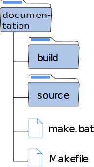

Installer son environnement
===========================

Sphinx est un module Python. Par conséquent, il faut avoir le langage Python installé sur sa machine. 
Comme tout module Python, on utilise la commande ``pip`` dans une console.

.. code-block:: bash
   
   pip install sphinx

Le module installé, la documentation se crée avec la commande ``sphinx-quickstart`` dans une console. Avant, on crée un
répertoire **documentation** qui contiendra toute la structure et les contenus.

.. tip::
   Ouvrir votre explorateur windows, naviguer jusqu'au dossier de documentation, puis dans la barre d'adresse, taper
   ``cmd`` devant l'adresse et valider.
   
   .. image:: ../img/ouvrir_cmd.svg
      :align: center

La console s'ouvre dans le dossier **documentation**. On saisit la commande ``sphinx-quickstart`` et on valide :

.. image:: ../img/sphinx-quickstart_1.jpg
   :align: left
   :width: 100%
   

Différentes questions s'affichent pendant la procédure.

1. La séparation entre le répertoire **source** contenant la documentation et le dossier **build** contenant l'export
   en html ou latex. Il est recommandé de ne pas les séparer mais nous allons quand même les séparer. Donc on répond
   ``y`` à la question.

2. Ensuite, on demande le nom du projet, le nom de l'auteur et la release du projet.

3. La langue du projet à choisir. Ici c'est ``fr``.

Voilà c'est fini. Ci-dessous une illustration de toute la procédure.

.. image:: ../img/sphinx-quickstart_2.jpg
   :align: left
   :width: 100%

Après exécution de la commande, la structure de notre projet est en place. Le dossier **documentation** contient deux
dossiers **source** et **build** et 2 fichiers **make.bat** et **Makefile**.

.. note::
   Le dossier **build** est vide. Aucune documentation n'est construite mais la structure est en place.
   
Le dossier **source** contient deux dossiers **_static** et **_templates** et deux fichiers. Ces 2 dossiers resteront
vides jusqu'au moment où nous modifierons l'apparence du projet. Les deux fichiers sont **conf.py** et **index.rst**.

.. rubric:: conf.py

C'est le fichier de configuration de notre projet. Il contient des informations sur la structure de notre projet, son
nom, le nom de l'auteur et des informations sur les extensions que l'on peut utiliser.

.. rubric:: index.rst

C'est notre premier fichier **reStructured Text** créé par défaut. C'est le point de départ, la page d'accueil, de
notre documentation.

Le dossier **source** va contenir tous les contenus de notre documentation. Celle-ci peut contenir des fichiers ou
différents dossiers contenant de nombreux fichiers. Pour notre projet, on ajoute deux dossiers vides qui contiendront
la documentation sur **sphinx** et et la documentation sur la syntaxe **rest**.

Donc au final, le dossier source a pour contenu 4 dossiers et 2 fichiers comme le montre la figure suivante.

.. image:: ../img/arbo_1.svg
   :alt: Arborescence documentaire
   :align: center

L'installation et la mise en forme de la structure sont réalisées. Il ne reste plus qu'à construire la documentation.

