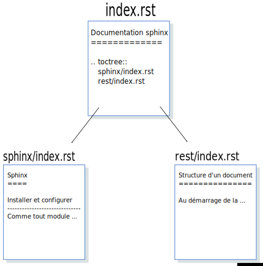

Structure d'un document
=======================

La création de la structure de la documentation avec la commande ``sphinx-quickstart`` crée le fichier ``index.rst`` dans le dossier **source**. Ce fichier est la page d'accueil de notre export html, il contient donc les liens vers les autres pages de notre documentation.

Par exemple, pour cette documentation, le fichier ``index.rst`` contient les liens vers les 2 fichiers ``index.rst`` placés dans les dossiers ``sphinx`` et ``rest``.

L'insertion des liens vers les autres fichiers se fait avec une directive ``toctree`` placée dans le fichier ``index.rst`` du dossier ``source``:

.. code::

   .. toctree::
      :maxdepth: 1

      sphinx/index.rst
      rest/index.rst

On a donc un fichier qui contient 2 liens vers 2 autres fichiers situés dans 2 dossiers du répertoire ``source``.

   Structure un document

.. note::

   Chaque fichier ``index.rst`` peut pointer vers d'autres fichiers situés dans les dossiers ``rest`` et ``sphinx``.
