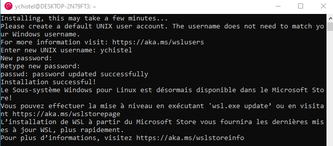
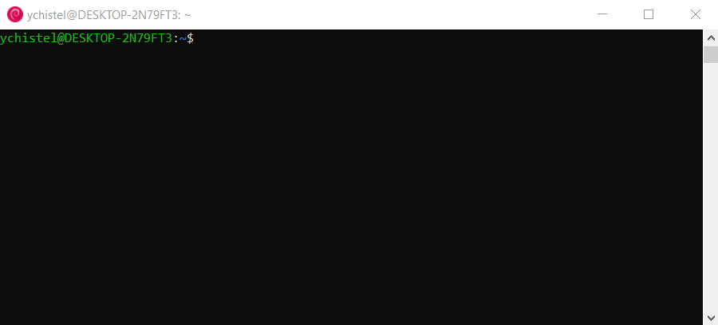

Ouvrir dans windows le powershell et saisir la commande ``wsl --install``

Il faut redémarrer la machine avant d'installer une distribution Linux.

Ajouter une distribution linux. Par exemple la distribution Debian, saisir la commande:

.. code-block:: bash

   wsl --install -d Debian

   Installation en cours : Debian GNU/Linux
   Debian GNU/Linux a été installé.
   Lancement de Debian GNU/Linux...

Pendant l'installation, un terminal s'ouvre indiquant l'installation de la distribution.

La création d'un compte est requis. Il faut saisir un `username` et son mot de passe. Cet utilisateur fait partie du groupe `sudo` et pourra administrer le système linux.

Après l'installation, le noyau linux est un noyau de base. Il faut commencer par le mettre à jour:

.. code-block:: linux

   sudo apt update
   sudo apt upgrade

Après l'installation de la distribution, on remarque une entrée de programme dans le menu démarrer avec en icone le logo de la distribution Debian. Elle se lance comme toute application windows.

Le lancement de l'application ouvre un terminal avec le prompt linux de la distribution Debian.

